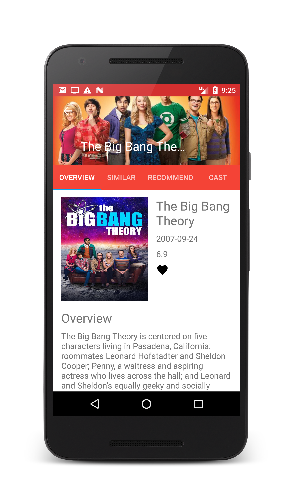

# BoboMovie
## Description
BoboMovie is an android movie app which allowed the user to visit the recent, popular, and high rating movie, TV and artist information. 
[TMDb API](https://www.themoviedb.org/documentation/api) provides all the information for this app.

## Features
* Listing all the movies, tvs and artists image 
* Viewing the profile of each movie, TV and artist
* Providing detail(cast, crew, similar, recommend, videos and reviews) for each movie, TV and artist
* Using different criteria(recent, popular, rate, now playing and upcoming) to sort the movies and TVs
* Storing favourite movie in the app

## Tech Stack
 * ContentProvider
 * SQLite
 * REST API
 * Android Library
   - OKHttp
   - Picasso
   

## Sreenshot

## Next
* Third Party Login
* Comments
* Searching
